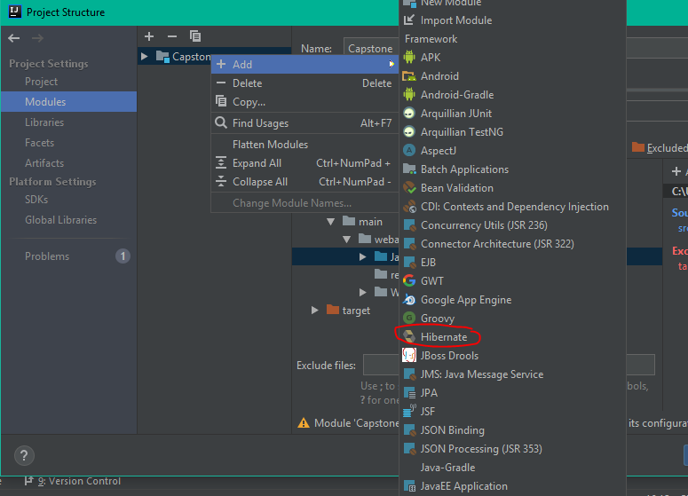
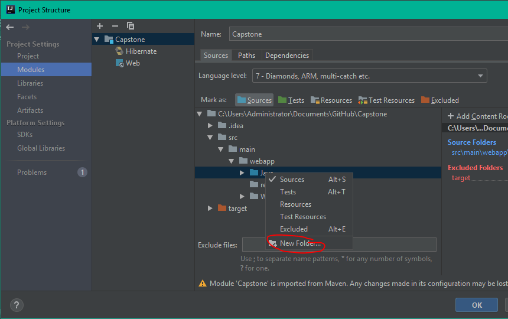
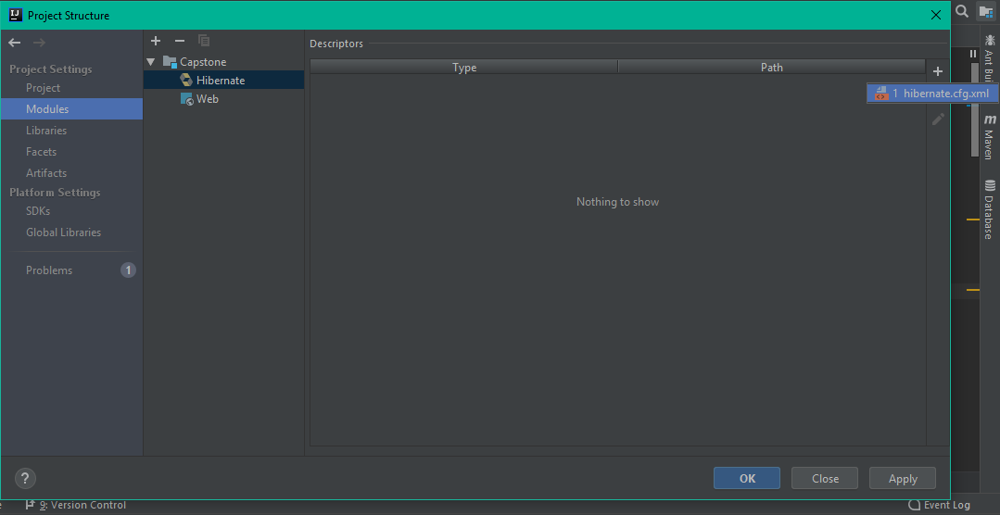
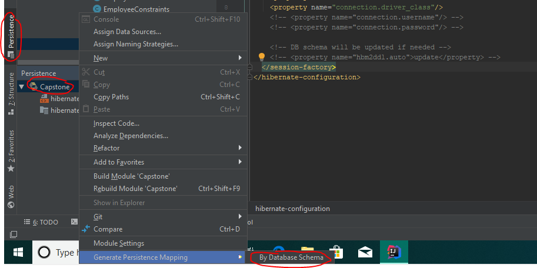
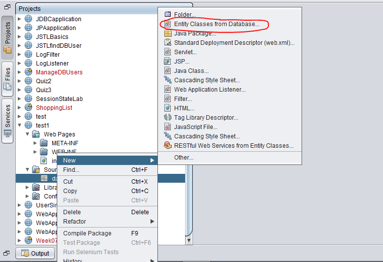
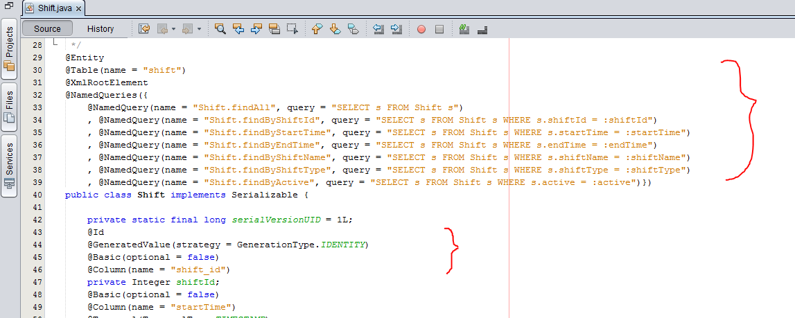

## Welcome to My Blog
  
In this blog, I am going to use Intellij as my IDE and MySQL as my database. Actually, my plan for this blog is going to talk more about C++, but after I started to set up the hibernate to build a connection with database I realize that this process will be a pain at the beginning for the project. Now, It is a good chance to share the information of how I solve this problem so that if anyone else meets similar problems, this blog may give you some usefule ideas.

## Getting started with Hibernate
Just like the Java Persistence API(JPA), Hibernate is an implementation of JPA. Specifically, JPA is a Java specification for accessing, persisting and managing data between Java objects an relational database. You can follow and use the annotations from JPA but nothing will happen without using JPA provider, like Hibernate, Eclipselink, Toplink and so on. In my case, Hibernate will be used to map the tables of the database.

In order to using Hibernate, there are two thing we need to prepare. One thing is adding the Hibernate library to our project and the other thing is to set up the Hibernate configuration file so that the mapping of Hibernate is working.

Since I am using Maven as my project management, I just need to add the [Hibernate dependency](https://mvnrepository.com/artifact/org.hibernate/hibernate-core/5.4.1.Final) on the pom.xml file which is the configuration file for Maven project. I also want to mention that if you are using **Intellij** as you development tool, you need to add the new library to the artifact in the **project structure** section in order to compile the program using the library you already set. Otherwise, the libraries you added will be useless and the program propably can not run.

### Adding the Hibernate library

```markdown
<!-- https://mvnrepository.com/artifact/org.hibernate/hibernate-core -->
<dependency>
    <groupId>org.hibernate</groupId>
    <artifactId>hibernate-core</artifactId>
    <version>5.4.1.Final</version>
</dependency>

```

### Hibernate configuration

There are two type of configuration files you can use, which are **hibernate.properties** and **hibernate.cfg.xml**. Bother files are equivalent and I will prefer using hibernate.cfg.xml file as I am more familiar with the format of it. 

For Intellij, we have to go to the Module section to add Hibernate to support our project.


Then, we need to create the new folder under the source folder(you need to mark it) and mark it as resource folder and configuration file will be hoested in this folder.


In the same section, select the Hibernate icon and click `+` to make the **hibernate.cfg.xml** file. 


After that, you are able to find the configuration file in the resources folder. Here is my configure file example.

```markdown
<?xml version='1.0' encoding='utf-8'?>
<!DOCTYPE hibernate-configuration PUBLIC
    "-//Hibernate/Hibernate Configuration DTD//EN"
    "http://www.hibernate.org/dtd/hibernate-configuration-3.0.dtd">
<hibernate-configuration>
  <session-factory>
    <property name="connection.url">jdbc:mysql://localhost:3306/DB_name</property>
    <property name="connection.username">root</property>
    <property name="connection.password">password</property>
    <property name="connection.driver_class">com.mysql.jdbc.Driver</property>
    <property name="dialect">org.hibernate.dialect.MySQL57Dialect</property>

    <property name="show_sql">true</property>

    <property name="format_sql">true</property>
    <property name="hbm2ddl.auto">create</property>

    <!-- This the Java class that will be mapped /-->
    <mapping class="test.Department" />
  </session-factory>
</hibernate-configuration>
```

As you can see, we have to define the class path, driver class, username and password for the connection to the MySQL database, which is very similar to the way we did using Java classes. The property dialect means what kind of database language we are going to use so that the Hibernate will know how to communicate with the database we use in order to retrieve and save the data. The second important property for this xml file is the `hbm2ddl.auto`. There are several values we can set, such as `create`, `update` and `validate`, which are very useful features of Hibernate. For example, if we write **create**, Hibernate will destroy the original tables if they exist and automatically manipulate corresponding tables in the database each time whenever the program is executed. **Update** values will enable Hibernate to check and update the schema and the **validate** value will let Hibernate to validate the schema of the database.

## Generating mapping

Now, you may realize the importance of JPA provider, Hibernate, to truly implement the Object-Relational Mapping(ORM). 

Basically, there are two common ways to generate mapping between Java classes and the data in the database. The first approch is adding annotations to the persistent classes which are also known as Plain Old Java Object(POJO) in Java. After using session factory object to run the configuration file, Hibernate API will automatically generating tables in the database if developers set the the value of `hbm2ddl.auto` `create`. This method requires the developers need to learn some JPA anotation knowledge in order to generating the mapping correctely and effectively.

As I am still in learning process, I would prefer the second approch, which is using the functions of IDE to automatically create mapping entity class. In order to do that, the programmers have to manually create the tables in the database first so that the IDE can generate the persistent classes using your database information. By this way, programmers do not need to spend a lot of time on learning JPA anotations and are able to quickly grap the Hibernate's useful features and focus on developing their program. However, I do not mean that there is no need to keep study the JPA annotations. We still need to keep exploring the area we do not know.

Even though I am using Intellij but Netbeans would be a better choice for mapping since Netbeans will generate all the usefule JPA quiries at the top of the persistent class and we can just copy and paste these quiries into the class that will operate retrieving from and saving data to the database. Let me show you how to do.

### For Intellij

Go to the Persistence section, right click the project and choose generating persistent mapping by database schema(you have to set up the database connection in the IDE first). 


Then, just select what entity classes you want to generate and follow the instruction.

### For Netbeans

Using Netbeans to generate mapping is very simple. Right click the packege the persistent classes will be stored and under the new option select **Entity classes from database**.


This is the very useful quries part for annotation in Netbeans I mentioned before.


## Summary

In my opinion, both method of generating mapping have their benefit and downside. Writing annotation can let developers focus on their programming tasks and save a lot of time to figure out how to deal with the data with database but the premise is that the developers are confident to write those annotation correctely. Another way is very convenient but the developers may not have enough knowledge about JPA, which is not the good way to upgrade their skill. In addition, before you are going to generate persistent classes, it is better to spend a little of time on considering what data type will be supported in the database and Java classes so that they can match each other effectively.
